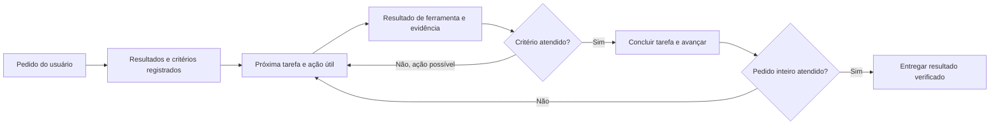

# Segunda análise: fazer o pedido virar execução e conclusão

Data: 2026-09-09 (America/Sao_Paulo). Referências remotas conferidas em 2026-09-10 02:54 UTC.
Pedido: estudar novamente Oh My Pi, Hermes e DeepSeek Harness para melhorar criação e finalização de tarefas no Redcode.
Escopo: pesquisa e recomendação de implementação. Nenhuma alteração de runtime, configuração do usuário, publicação ou release nesta rodada.

## Síntese executiva

**A próxima prioridade é fechar os vínculos pedido → tarefa → ação → evidência → conclusão.** A lista persistida é necessária, mas não verifica que o agente capturou o pedido inteiro nem que fez o que marcou como concluído. No Redcode, a nova persistência local corrige perda por atualização parcial; criação, cobertura e conclusão de tarefas comuns continuam principalmente sob responsabilidade do modelo. [R1–R4]

Três referências complementares:

- **Oh My Pi:** instruções operacionais no início, no handoff de plano e durante o trabalho. Uma lista deve acompanhar ações, não ser a única entrega do turno. Há opções de criação forçada e classificação de paradas prematuras, mas não são todas padrão. [O1–O4]
- **Hermes:** contexto de tarefas reconstituído após compactação e encerramento explícito no Kanban. Um processo terminar com sucesso não conclui seu cartão. O mecanismo de verificação de código é opt-in. [H1–H5]
- **DeepSeek Harness:** objetivo durável inferível de pedido humano, continuação separada e limitada, revisão e origem conferidas no runtime. Seu driver não possui avaliador independente da conclusão. [D1–D3]

Esses mecanismos não demonstram superioridade dos modelos nem permitem afirmar aumento de produtividade. É uma análise de código e de contratos, com probes locais pequenos; não um benchmark de entrega.

## Referências e atualização

| Referência | Commit | Situação |
| --- | --- | --- |
| Oh My Pi | `2e6b5b79a0c5b190797aace99f41fab6ae42e6c5` | HEAD remoto confirmado |
| Hermes | `f97a4102dd3864eed0c85132850ce7e06f13e09a` | HEAD remoto confirmado; arquivos estudados iguais aos de `f6ddd89692dff1f900983a16208f39a1485a14eb` |
| DeepSeek Harness | `b2e3b2a0125854567a4a5fcba75782e42fe84901` | HEAD remoto confirmado |
| Redcode publicado/main | `4f5cad15d92d1010a13c2a4603748ca4b9122832` | HEAD remoto confirmado |
| Redcode local | `10a0392366` | Branch `harness-execution`; inclui a persistência de tarefas, ainda sem push/release |

A comparação oficial de Hermes mostrou dois commits adicionais, limitados a relay e testes de gateway; não houve alteração nos arquivos de tarefas, verificação e dispatcher examinados. [H0]

Esta análise complementa o [primeiro relatório](2026-09-09-harness-task-execution.md). A diferença relevante é avaliar explicitamente o estado posterior à nossa implementação local, em vez de continuar descrevendo como ausentes mudanças já feitas.

## O que cada projeto realmente impõe

| Momento | Oh My Pi | Hermes | DeepSeek Harness |
| --- | --- | --- | --- |
| Criar tarefas | Guidance exige enumerar todos os itens; `todo.eager=always` pode forçar a primeira ferramenta, com condições | Descrição exige cobertura; `todo_list` da conversa é distinto do Kanban | `todo_write` orienta lista completa; Goal pode nascer de pedido humano prolongado |
| Executar | Plano aprovado manda inicializar todos e executar; operações promovem a próxima tarefa | Worker recebe contexto do cartão; dependências são geridas pelo quadro | Driver admite rodadas do Goal quando autorizado e o agente está ocioso |
| Manter contexto | Tracker reidrata a lista do branch; lembretes intermediários limitados | Snapshot ativo é reinjetado depois da compactação | Goal tem estado durável; projeção de todo é limpa no próximo `turn/start` |
| Concluir | `done` ainda é declaração do modelo; lembretes cobram tarefas abertas | Kanban exige transição terminal; verificação de código opcional | Modelo declara conclusão com ID/revisão; driver não certifica o resultado |

Fontes: [O1–O4, H1–H5, D1–D4]. Não confundir guidance, validação de argumentos, estado persistido e prova do resultado: são camadas diferentes.

## 1. Oh My Pi: reduzir o intervalo entre intenção e ação

### Criação e handoff

A descrição de `todo` exige representar cada item de pedidos enumerados, capturar novas instruções e continuar trabalho real no mesmo turno. O prompt de plano aprovado exige inicialização de todos, atualização após cada passo e correção de payload quando a ferramenta falha. O caminho normal ainda depende do modelo obedecer. [O1, O2]

`todo.eager` tem `default`, `preferred` e `always`. O tracker pode usar `tool_choice` no último caso, se suportado pelo provider. Porém ignora condições como Plan ativo, lista já existente, handoff de prewalk e certos prompts terminados em `?` ou `!`. Não copiar pontuação como classificador: “consegue corrigir esses três bugs?” é um pedido de ação. [O3]

### Trabalho real e parada

O tracker pode lembrar de atualizar progresso após 12 resultados de ferramentas classificadas como mutantes, com no máximo duas intervenções no ciclo. Isso conta ferramentas, não diffs comprovados. A lista normaliza a próxima tarefa e exclui bloqueados dos lembretes de conclusão. [O1, O3]

A opção `smart` usa um classificador para respostas que prometem agir e param. O padrão é `mechanical`; não atribuir a toda instalação o detector semântico. O classificador lê a mensagem candidata e não comprova autorização pelo pedido completo: um exemplo seu considera “Should I do that for you?” uma parada inesperada. Para o Redcode, só deve continuar se a ação já estiver autorizada. [O4]

**Adaptar:** começo com tarefa e ação no mesmo turno, handoff explícito e detector limitado de promessas sem execução. Usar estado de permissões/perguntas reais, não heurísticas de texto, para determinar se é correto prosseguir.

## 2. Hermes: contexto atual e conclusão como transição

### Lista da conversa não é o quadro

`todo_list` mantém IDs, pais e revisão da lista; `merge=true` preserva entradas por ID, mas o padrão substitui tudo. Não há `blocked` nessa lista: a descrição sugere cancelar um item que falhou e adicionar uma revisão. Isso seria uma regressão para nossa preservação atual. A revisão retornada auxilia clientes, mas não é um argumento obrigatório de compare-and-swap no `TodoStore.write`. [H1]

Depois da compactação, `format_for_injection` mantém pendentes/em andamento e seus pais necessários; `_fold_todo_snapshot` substitui o snapshot antigo pelo estado atual. Concluídos independentes ficam fora desse contexto ativo. O código trata uma lista não vazia, mesmo toda concluída, como autoridade para remover um snapshot antigo de pendências. [H1, H2]

**Adaptar:** uma projeção compacta das tarefas atuais, reconstruída do store e vinculada ao contexto da sessão. Histórico completo continua disponível por leitura. No Redcode, essa projeção deve preservar também bloqueios e seus motivos.

### Encerramento e verificação

O guard de Kanban intervém quando um worker tenta sair sem ferramenta terminal; o dispatcher confere que um processo com código zero não deixou o cartão em `running`. Existem novas tentativas limitadas para essa violação de protocolo. Isso é específico de workers Kanban, não de todo chat Hermes. [H3]

Há uma limitação concreta no guard: ele identifica uma chamada terminal no histórico, mesmo se seu resultado for erro. O dispatcher é necessário para conferir o estado real. Ao adaptar, observar sucesso da transição persistida, não apenas presença de `kanban_complete` no transcript. [H3]

`verification_evidence` guarda comando, diretório, escopo, status e saída. `verification_status` verifica se a evidência antecede a última edição no workspace. O escopo focado/integral é registrado, mas esse status por si só não demonstra cobertura semântica de cada requisito. O guard não executa checks: pede ao modelo que os execute. `agent.verify_on_stop` está desligado por padrão; há override por `HERMES_VERIFY_ON_STOP`. [H4, H5]

**Adaptar:** evidência produzida a partir do resultado real da ferramenta, distinção entre check focado e suite completa, invalidação após mudanças e confirmação durável do encerramento.

## 3. DeepSeek Harness: objetivo e agendamento têm responsabilidades separadas

`create_goal` permite inferir um objetivo prolongado de uma solicitação humana direta; não exige a expressão “crie um goal”. O runtime verifica agente raiz vivo e origem humana no turno. Concluir/bloquear também pode ocorrer numa rodada do Goal correspondente à sua revisão. A origem precisa ser informada corretamente por produtores não humanos. [D1]

O driver é um componente separado: admite rodadas, aguarda seus checkpoints e só contabiliza rodadas que entram no histórico. O prompt orienta consultar workspace e resultados atuais, agir e verificar. Cancelamento/retomada têm regras próprias; um Goal antigo não é automaticamente rearmado pelo simples carregamento da sessão. [D2]

O próprio README declara ausência de avaliador independente. A ferramenta pode conferir revisão e limite mínimo para bloqueio, mas a interpretação de “objetivo alcançado” e “mesmo impedimento persistiu” continua no modelo. O cap de rodadas também não equivale a budget de tokens ou custo. [D1, D2]

`todo_write` substitui a lista completa e a projeção é zerada em `turn/start`; o evento histórico permanece. Não copiar isso para um backlog que deva persistir entre pedidos. O detector de repetição, com limiares padrão 3/5/8, é consultivo; ferramentas excluídas não quebram a sequência de repetição. [D3, D4]

**Adaptar:** continuidade ligada a objetivo, revisão, origem e motivo de parada. Reutilizar a admissão durável e o runner atuais do Redcode, sem instalar um segundo loop.

## 4. Diagnóstico atualizado do Redcode

| Área | Situação confirmada | Consequência |
| --- | --- | --- |
| Persistência | Branch local adiciona IDs/revisões, histórico, preservação de omitidos, próximo item e razões; main ainda não contém essa mudança | Resolve perda de material da lista, não cobertura do pedido [R1, R2] |
| Criação | Guidance instrui criar; `reminder([])` não intervém | Sem tarefas e sem Goal ativo, não há cobrança de todo para uma promessa vazia [R2, R3] |
| Cobertura | Input não registra vínculo obrigatório com item do pedido ou revisão de Plan | Um pedido de cinco itens pode virar uma tarefa genérica sem violar schema [R1, R4] |
| Plano aprovado | Os dois caminhos preservam revisão e fazem handoff para Build; não materializam tarefas ligadas à revisão | Aprovar ainda exige que o modelo reconstrua a decomposição [R4] |
| Contexto | `SessionProgressContext` inclui Goal e Plan, não um produtor específico de estado de tarefas | Tarefas chegam por resultados/histórico/lembretes; falta reidratação compacta própria no contexto [R3, R5] |
| Conclusão comum | `completed` não exige referência a evidência; `cancelled` exige texto de motivo, não vínculo com mudança autorizada do escopo | Checkbox e razão podem satisfazer o contrato sem demonstrar entrega ou autorização [R1, R2] |
| Goal V2 | Há verificação, evidências de arquivos, settlement e rejeição de alterações concorrentes | Já existe uma base forte para reutilizar; não tratar todo o harness como desprovido de verificação [R6] |
| Limite recente | Após sete continuações, a branch marca tarefas acionáveis como `blocked` | A parada fica registrada, mas mistura esgotamento do loop com impedimento da tarefa [R2, R3] |

Isso sustenta uma hipótese de processo, não prova a causa de todas as sessões frustrantes do usuário. Falta medir quantas param sem lista, com lista incompleta, com falsa conclusão ou em limite de execução.

## 5. Proposta de fluxo único para o usuário

Impedimento externo mantém tarefa aberta com motivo. Limite de execução pausa a execução e preserva o próximo passo; não precisa inventar impedimento em cada tarefa. Pedido de estudo termina em relatório. Plano termina em plano quando esse é o escopo. Uma pergunta de status durante implementação não deve substituir o pedido original.

O usuário não deveria precisar chamar `/tasks`, `/goal`, `/execute` e `/verify` para obter esse fluxo. Os mecanismos podem ter contratos internos distintos e controles avançados, enquanto a conversa cotidiana mantém uma experiência contínua.

## 6. Próximas entregas recomendadas

### 1. Captura e handoff com tarefas rastreáveis

Usar o mesmo store nos dois runtimes. Registrar origem de cada requisito: mensagem e item do pedido, ou revisão aprovada do Plan. Criar/reconciliar a decomposição de forma idempotente no handoff; novas instruções ampliam/revisam o conjunto sem apagar trabalho anterior. Um pedido simples não precisa dessa burocracia.

Não extrair um plano arbitrário apenas com regex nem tomar mudança de modo como prova de tarefas criadas. Se a decomposição depende de julgamento do modelo, explicitar esse limite e validar estruturalmente o vínculo com os itens já identificados.

Aceitação: cinco itens explícitos continuam rastreáveis após duas atualizações; aprovação repetida de uma revisão não duplica tarefas; Plan-only não inicia Build; após criação válida, o turno executa a primeira ação útil.

### 2. Contexto de execução e decisão única de parada

Adicionar tarefas ao mecanismo existente de Context Sources/Context Epochs: atual, próximas, bloqueadas e contagem resumida de concluídas, com leitura detalhada sob demanda. Reconstruir do store após compactação, com updates compactos quando o estado muda. Evitar reinjetar a lista/histórico completo em cada chamada e prejudicar o cache.

Antes da resposta final, produzir uma decisão compartilhada entre legado e V2: entregar, continuar ação, aguardar dependência/pergunta ou pausar por limite. A UI precisa apresentar o motivo e a próxima ação. Resolver a distinção orçamento/impedimento sem uma nova família de comandos visíveis.

Aceitação: retomada não refaz tarefas concluídas; uma pergunta de status não abandona execução; limite não converte pendências em sucesso nem em bloqueio externo fictício; usuário interromper impede reagendamento automático.

### 3. Conclusão proporcional à evidência

Registrar referências de resultados reais: ferramenta/call ID, worktree, revisão/arquivos observados, comando, status e critério coberto. Campos de conclusão fornecidos pelo modelo são alegações; conferir as referências no runtime. Reutilizar o settlement de Goal V2 onde aplicável, incluindo verificações após efeitos concorrentes.

Uma leitura ou relatório pode satisfazer tarefa de pesquisa; edição não comprova teste; teste focado não prova todos os requisitos; finalização de um processo não prova publicação. Usar regras determinísticas primeiro e avaliação semântica quando necessária, sem cobrar um juiz caro em cada microtarefa.

Aceitação: check conhecido como falho ou evidência invalidada por edição não sustenta conclusão; tarefa omitida permanece; cancelamento aponta para redução de escopo; pesquisa/documentação não exige testes sem relação com o pedido.

### 4. Só então calibrar persistência e detecção de pouco progresso

Cobrar atualização esparsa quando o estado fica parado; detectar promessas sem ação apenas com execução autorizada. Contar leitura e investigação como progresso possível. Separar polling de job real de repetição improdutiva. Não aumentar cegamente as sete tentativas e não multiplicar workers antes de medir ganho na sessão comum.

## 7. Probes executados e limites

- Hermes, implementação real de `TodoStore`: escrever A+B e depois somente A com o padrão deixou apenas A. Confirma a substituição destrutiva do default; não é comportamento a copiar.
- Hermes, `format_for_injection`: com A concluída e B pendente, snapshot preservou somente B. Confirma o recorte ativo pós-compactação.
- Hermes, guard de Kanban com ambiente de worker: promessa textual gerou nudge; resultado de `kanban_complete` contendo erro suprimiu nudge. Confirma por que conferir a transição no dispatcher é necessário.
- Hermes, configuração vazia sem override de ambiente: `verify_on_stop_enabled({})` retornou `False`.
- Redcode: `session-todo.test.ts` e `tool-todowrite.test.ts` passaram nesta rodada: 11 testes, 50 assertions. Validam a implementação local já existente. Não são benchmark de comportamento de um LLM.

Probes Python executaram módulos reais, sem provider, sem executar workers e com escrita de bytecode desabilitada. Não foram executadas suites completas dos três concorrentes. Os casos semânticos acima precisam de avaliações com modelos e pedidos reais.

## 8. Como decidir se ficou melhor

Comparar main e candidata com mesmo modelo/provider/configuração e pedidos repetidos. Incluir pedidos em português, pesquisas, correções enumeradas, Plan→Build, erro de teste, feedback no meio, compactação, bloqueio parcial e interrupção.

Métrica principal: **pedidos integralmente atendidos e verificados sem um “continue” humano evitável**. Medir também cobertura de requisitos, falsas conclusões, tempo até primeira ação útil, tarefas refeitas após compactação e custo por entrega. Publicar erros e limites, não apenas contagem de checkboxes concluídos.

## Fontes oficiais e atalhos

As fontes externas abaixo apontam a commits fixos; R1–R6 descrevem o checkout local em `10a0392366`, ainda não publicado. O relatório anterior contém o mapa mais amplo de fontes.

- [O1: ferramenta todo](https://github.com/can1357/oh-my-pi/blob/2e6b5b79a0c5b190797aace99f41fab6ae42e6c5/packages/coding-agent/src/prompts/tools/todo.md).
- [O2: plano aprovado](https://github.com/can1357/oh-my-pi/blob/2e6b5b79a0c5b190797aace99f41fab6ae42e6c5/packages/coding-agent/src/prompts/system/plan-mode-approved.md).
- [O3: tracker](https://github.com/can1357/oh-my-pi/blob/2e6b5b79a0c5b190797aace99f41fab6ae42e6c5/packages/coding-agent/src/session/todo-tracker.ts).
- [O4: configuração](https://github.com/can1357/oh-my-pi/blob/2e6b5b79a0c5b190797aace99f41fab6ae42e6c5/packages/coding-agent/src/config/settings-schema.ts), [classificador](https://github.com/can1357/oh-my-pi/blob/2e6b5b79a0c5b190797aace99f41fab6ae42e6c5/packages/coding-agent/src/session/unexpected-stop-classifier.ts) e [prompt](https://github.com/can1357/oh-my-pi/blob/2e6b5b79a0c5b190797aace99f41fab6ae42e6c5/packages/coding-agent/src/prompts/system/unexpected-stop-classifier.md).
- [H0: mudanças desde a leitura anterior](https://github.com/NousResearch/hermes-agent/compare/f6ddd89692dff1f900983a16208f39a1485a14eb...f97a4102dd3864eed0c85132850ce7e06f13e09a).
- [H1: todo](https://github.com/NousResearch/hermes-agent/blob/f97a4102dd3864eed0c85132850ce7e06f13e09a/tools/todo_tool.py).
- [H2: compactação](https://github.com/NousResearch/hermes-agent/blob/f97a4102dd3864eed0c85132850ce7e06f13e09a/agent/conversation_compression.py).
- [H3: guard](https://github.com/NousResearch/hermes-agent/blob/f97a4102dd3864eed0c85132850ce7e06f13e09a/agent/kanban_stop.py) e [dispatcher](https://github.com/NousResearch/hermes-agent/blob/f97a4102dd3864eed0c85132850ce7e06f13e09a/hermes_cli/kanban_db_dispatch.py).
- [H4: evidência](https://github.com/NousResearch/hermes-agent/blob/f97a4102dd3864eed0c85132850ce7e06f13e09a/agent/verification_evidence.py).
- [H5: verificação ao parar](https://github.com/NousResearch/hermes-agent/blob/f97a4102dd3864eed0c85132850ce7e06f13e09a/agent/verification_stop.py) e [integração no loop](https://github.com/NousResearch/hermes-agent/blob/f97a4102dd3864eed0c85132850ce7e06f13e09a/agent/turn_stop_gates.py).
- [D1: ferramentas de Goal](https://github.com/deepseek-ai/deepseek-harness/blob/b2e3b2a0125854567a4a5fcba75782e42fe84901/packages/goal/tool-goal/src/index.ts) e [autoridade](https://github.com/deepseek-ai/deepseek-harness/blob/b2e3b2a0125854567a4a5fcba75782e42fe84901/packages/goal/tool-goal/src/authority.ts).
- [D2: driver](https://github.com/deepseek-ai/deepseek-harness/blob/b2e3b2a0125854567a4a5fcba75782e42fe84901/packages/goal/goal-round-driver/README.md) e [prompt de rodada](https://github.com/deepseek-ai/deepseek-harness/blob/b2e3b2a0125854567a4a5fcba75782e42fe84901/packages/goal/goal-round-driver/src/prompt.ts).
- [D3: repetição](https://github.com/deepseek-ai/deepseek-harness/blob/b2e3b2a0125854567a4a5fcba75782e42fe84901/packages/guard/repeat-tool-reminder/README.md).
- [D4: todo e projeção](https://github.com/deepseek-ai/deepseek-harness/blob/b2e3b2a0125854567a4a5fcba75782e42fe84901/packages/todo/tool-todo/src/index.ts).
- R1: [schema](../../packages/schema/src/session-todo.ts), [store](../../packages/core/src/session/todo-store.ts).
- R2: [política compartilhada](../../packages/core/src/session/todo.ts), [ferramenta](../../packages/core/src/tool/todowrite.ts).
- R3: [runner V2](../../packages/core/src/session/runner/llm.ts), [loop legado](../../packages/redcode/src/session/prompt.ts).
- R4: [Plan V2](../../packages/core/src/tool/plan.ts), [Plan legado](../../packages/redcode/src/tool/plan.ts).
- R5: [Context Source de progresso](../../packages/core/src/session/progress-context.ts).
- R6: [verificação de Goal](../../packages/core/src/tool/goal.ts), [settlement](../../packages/core/src/session/goal-completion.ts).
