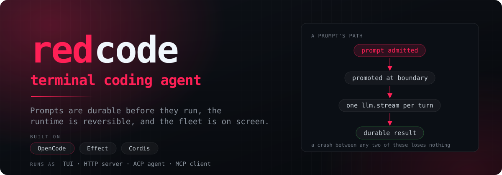
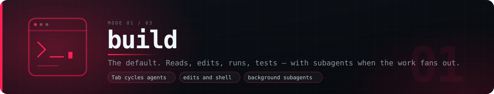
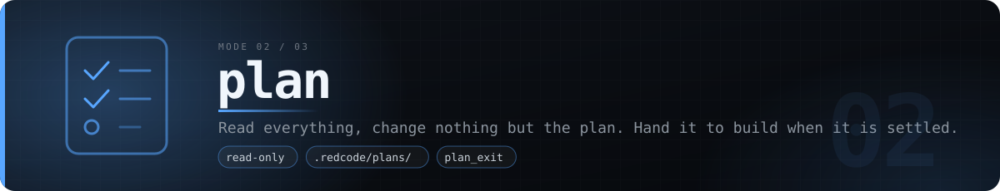
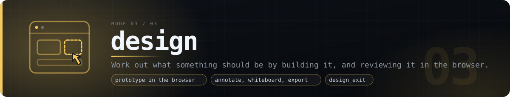
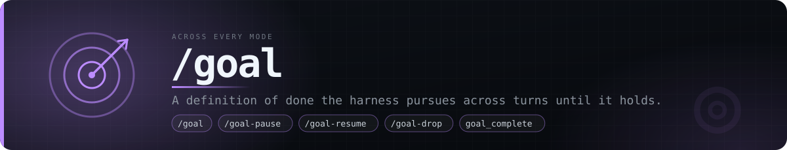

<div align="center">



<p>
  <a href="https://www.npmjs.com/package/@reddb-io/redcode"></a>
  <a href="https://github.com/reddb-io/redcode/actions/workflows/red-workspace-ci.yml"></a>
  <a href="LICENSE"></a>
  <a href="#use"></a>
</p>

<strong>RedDB's terminal coding agent.</strong><br>
Prompts are durable before they run, the runtime can be taken apart and put back
together, and the autonomous Worker fleet is on screen next to your session.

</div>

---

Redcode is reddb.io's coding agent for our own engineering work. It is built on
[OpenCode](https://github.com/anomalyco/opencode) — their agent loop, providers, tools, and terminal
UI are the foundation this stands on — and its runtime composition is modelled on
[DeepSeek Harness](https://github.com/deepseek-ai/deepseek-harness). Both are projects we learned a
great deal from, and neither owes us anything.

Attribution is preserved in [NOTICE](./NOTICE).

One property shapes everything else: **a prompt becomes durable before anything tries to execute
it**. Read [The Session Model](#the-session-model) first — the rest of this document assumes it.

## Contents

**Start here**

- [What Ships And What Doesn't](#what-ships-and-what-doesnt) — the one distinction that makes this repo readable
- [The Session Model](#the-session-model) — durable admission, delivery, and provider turns

**Core**

- [The Runtime](#the-runtime) — the Effect kernel and reversible plugin profiles
- [Workers](#workers) — the RedSkills fleet console
- [Architecture](#architecture) — dependency direction and the packages that carry weight

**Installing and using it**

- [Install](#install) — native CLI and installation methods
- [Use](#use) — every command, and what it is for
- [Modes](#modes) — Build, Plan and Design, with explicit handoffs
- [Design Mode](#design-mode) — prototype in the browser, review it there, come out with a plan
- [Goal](#goal) — a definition of done the harness pursues across turns

**Reference**

- [A Note On Names](#a-note-on-names) — why the source says OpenCode
- [Status](#status) — what is shipped and what is deliberately not
- [Development](#development) — building and testing Redcode itself
- [Releases](#releases) — changesets, the Version PR, and immutable tags
- [Lineage](#lineage) — what we owe OpenCode, DeepSeek, and Cordis
- [License](#license)

## What Ships And What Doesn't

This repository contains far more than the product, because it inherits a monorepo built for a
larger surface than Redcode targets. Telling the two apart is the fastest way to read it.

**Ships — this is Redcode.**

| Piece | What it is | Where |
| --- | --- | --- |
| `@reddb-io/redcode` | The native `redcode` CLI and its `redcode-rpc-sidecar` companion. | [Install](#install) |
| The TUI | Sessions, diffs, permissions, and the Worker fleet | [Use](#use) |
| The server, ACP agent, MCP client | The same binary, other entry points | [Use](#use) |

**Does not ship — present, useful in development, never published.**

| Piece | What it is |
| --- | --- |
| `packages/cli` | A parallel Effect-native CLI preview whose binary is `lildax`. Not the product. |
| `packages/desktop`, `packages/web` | Electron and Astro surfaces inherited from upstream |
| `packages/console`, `packages/stats` | Hosted opencode.ai services, not ours to run |
| `packages/storybook`, `packages/enterprise`, `packages/slack` | Upstream workspaces we do not build |

That boundary is not a convention — it is a **ratchet**. `script/test-redcode-release-contract.ts`
runs in CI and fails the build if any of 22 deleted upstream workflows reappear, if `sst deploy`,
`docker buildx build`, or a stray `npm publish` shows up outside the single release workflow, or if
`red-publish.yml` starts mentioning `beta`, `docker`, `desktop`, `sst`, or `vscode`.

## The Session Model

Most agents accept your prompt into memory and start working. If the process dies in between, the
prompt is gone and you find out by noticing that nothing happened.

Redcode splits those two steps. **`SessionV2.prompt(...)` writes one durable input row and returns**;
only then does it schedule an advisory wake for the executor. Admission and execution are separate
concerns with separate failure modes, which is what makes the rest of the model possible.

| Step | What is guaranteed |
| --- | --- |
| **Admission** | The prompt is durable. Reusing a prompt ID reconciles an exact retry instead of duplicating work; conflicting reuse fails loudly. |
| **Promotion** | An admitted prompt becomes a visible user message only at a safe provider-turn boundary — after durable input promotion and any required tool settlement. |
| **Provider turn** | Exactly one explicit `llm.stream(request)` call. Projected history is reloaded before durable continuation rather than carried in memory across the boundary. |
| **Result** | One normalized durable result per admitted tool call, in the model's own result order even when tools ran concurrently. |

Delivery is explicit vocabulary, not a heuristic:

- **Steer** (the default) — the input lands at the next safe boundary while the current drain keeps
  going. A batch of steers resets the agent's provider-turn allowance once.
- **Queue** — the input stays pending until the Session would otherwise go idle, then exactly one
  queued input is promoted before continuation is reevaluated.

What the model sees is assembled the same way: **System Context** is a set of typed Context Sources
with stable keys, JSON codecs, and pure renderers, cut by a persisted **Context Epoch** — not a
string template someone concatenated. When a source changes mid-conversation, the model is told the
newly effective state chronologically instead of having its history rewritten underneath it.

`CONTEXT.md` is the full vocabulary. It is worth reading before arguing about what a term means.

## The Runtime

Services, resources, and lifetimes are typed with [Effect](https://effect.website) and scoped by
**Location** — a directory plus its project, and eventually a workspace. `SessionRunner`, model
resolution, the tool registry, permissions, and the filesystem are Location-scoped;
`SessionExecution` is process-global and keyed by Session ID, so no layer ever takes a Session ID
just to work out where execution belongs.

On top of that sits the part we adapted from DeepSeek Harness. Internal plugins are not an
imperative sequence of `add` calls — they are **one named profile mounted through a Cordis host**:

- activation is **ordered and awaited**, so "ready" means the composition actually settled;
- teardown is awaited, so removing a plugin means its effects are gone, not scheduled to go;
- replacement is **transactional** — a failed candidate restores the previous profile;
- boot is not ready until every **runtime invariant** registered by its owning package has run.

The boundary is deliberate and documented in
[ADR 0001](./.red/adr/0001-hybrid-cordis-effect-plugin-runtime.md): Cordis owns *only* the outer
composition fibers, Effect keeps owning services and cleanup, and Cordis never becomes a second
service locator. Dynamic model-authored plugins, config HMR, and YAML profile loading are explicitly
**not** enabled — the Harness supports executable configuration expressions, and we chose not to
take that.

The audit behind those choices, including the principles we have not earned yet, is in
`.red/researches/`.

## Workers

Redcode integrates natively with [RedSkills](https://github.com/reddb-io/red-skills) and its
host-scoped `redskilled` daemon, so the autonomous fleet is a tab in your session rather than a
separate dashboard.

The **Workers** view is a live, project-scoped console over the daemon's public ACP session:

- **Per Worker** — identity, process, start time, elapsed time, and declared memory budget from the
  public Project projection. Rich phase, heartbeat, log, and host-capacity details remain blank
  because the public ACP snapshot does not expose them.
- **History** — arrivals and departures observed through successive ACP snapshots remain visible in
  the local activity feed.
- **Control** — Project drain, stop, and status use redskilled's advertised typed methods. Resize and
  Worker stop, recycle, and steer run as generic ACP Project turns (`/project_resize`, `/worker_stop`,
  `/worker_recycle`, and `/runner_steer`); `enter` expands one Worker to full width and `o` opens its
  issue. Redcode does not poll `steer_status`, because ACP core exposes no typed result for that read.

Redcode stores no separate consent, registration, or Project-control state. Drain intent and policy
remain daemon-owned, and status comes from the Project projection reached through the supported
`red-skills-redskilled acp` stdio adapter. Host-wide details are not presented because the public ACP
session deliberately binds each connection to one Project.

## Install

```bash
npm install -g @reddb-io/redcode
redcode
```

Bun, pnpm, and Yarn work too. The install resolves one native package for your platform — Linux
(glibc and musl, x64 and arm64), macOS (x64 and arm64), and Windows (x64 and arm64), with non-AVX2
variants where the architecture needs them. Each package contains `redcode` and the matching
`redcode-rpc-sidecar` companion.

### With mise

mise installs the release binary straight from GitHub, no Node required. This is what
[red-dev](https://github.com/reddb-io/red-dev) sets up, so a machine provisioned by it already has
Redcode this way.

```bash
mise use -g github:reddb-io/redcode@latest
redcode
```

Upgrade the same install with:

```bash
mise upgrade github:reddb-io/redcode
```

Two notes worth knowing:

- Pin `@latest` rather than an exact version. `mise upgrade` keeps whatever range the tool was
  installed with, so an exact pin never moves on its own.
- If an upgrade reports success but `redcode --version` does not change, mise served a cached
  version list. Run `mise cache clear github:reddb-io/redcode` and upgrade again.

Keep one installation method per machine. An npm global and a mise install can both provide
`redcode`, and then `$PATH` order decides which one runs — updating the one you are not running
looks like an update that did nothing. `which redcode` tells you which copy is live.

There is no beta channel, no container image, no desktop build, no package-manager tap, and no
hosted deployment. See [What Ships And What Doesn't](#what-ships-and-what-doesnt) for why that is
enforced rather than merely intended.

## Use

Running `redcode` with no arguments opens the TUI directly in a new session.

| Command | What it does |
| --- | --- |
| `redcode` | Terminal UI — sessions, diffs, permissions, and the Workers fleet |
| `redcode run` | Non-interactive prompt; `--format json` emits structured records |
| `redcode design` | Interactive SessionV2 terminal with Design, Plan, Build and browser review |
| `redcode serve` | Headless HTTP server exposing the Protocol API |
| `redcode acp` | Agent Client Protocol over stdio; `--experimental-toon` selects TOON-RPC framing |
| `redcode mcp` | Manage the MCP servers Redcode connects to — it is an MCP client, not a server |
| `redcode attach` | Attach to a running server |
| `redcode web` | Start the server and open the local web interface |
| `redcode session` | Manage Sessions |
| `redcode agent` / `plugin` / `models` / `providers` | Configure what the agent is made of |
| `redcode export` / `import` | Move Session history in and out |
| `redcode github` / `pr` | Repository automation |
| `redcode stats` | Token usage and cost |
| `redcode db` / `debug` | A sqlite shell over the durable store, and dumps for config, agents, skills, LSP, and the V2 catalog |

`redcode --help` lists everything, including `upgrade`, `uninstall`, `generate`, and `console`.

In the TUI, the line under the prompt shows context use and cost. The Context sidebar shows
latency to the first token of the last answer and its token throughput.

`redcode serve` prints both its base URL and the exact `POST /rpc` endpoint. That endpoint accepts
JSON-RPC 2.0 (`application/json`) and TOON-RPC 1.0 (`application/toon`) for the same typed read-only
methods: `health.get`, `session.list`, and `session.active`. `session.list` accepts the same filters,
ordering, limit, and cursor semantics as `GET /api/session`.

The sibling `redcode-rpc-sidecar` bridges bounded `Content-Length` frames on stdin/stdout to that
HTTP endpoint. Set `REDCODE_RPC_URL` to the printed URL. It reuses
`OPENCODE_SERVER_USERNAME`/`OPENCODE_SERVER_PASSWORD`, or accepts a complete
`REDCODE_AUTHORIZATION` header.

## Modes

Build, Plan and Design define what the agent may change. The full-screen TUI uses its existing
session runtime for Build and Plan; `Tab` switches between available agents. Design now starts in
its own SessionV2 terminal with `redcode design`, or in a SessionV2 session in the web app. The
TUI's `/design` command shows how to open that terminal. Existing conversations are preserved;
a legacy session ID cannot be adopted as a V2 session.

In `redcode design`, use `/mode design|plan|build` to change the active mode explicitly. Mode
changes keep the current SessionV2 history; they do not expand an existing Goal's scope.



**Build** reads, edits and runs commands under your configured permissions. Use it to implement
an approved plan or work directly on product code.



**Plan** explores the repository and writes the implementation plan under `.red/code/plans/`.
`plan_exit` reads and records the reviewed file before a handoff. In SessionV2, the approved
revision and contents survive continuation and compaction. A Plan-only Goal stays in Plan;
entering Build requires approval or prior explicit execution authorization.



**Design** builds interactive prototypes in a separate work directory, gathers review feedback,
and hands an approved revision to Plan. Its default permissions protect product files. It can
reuse application components and design-system evidence through authorized reads.

## Design Mode

Design combines a resumable terminal session with a browser review surface. It supports HTML,
React and Solid prototypes, versioned assets, editable SVG-to-GIF exports, and recorded approval.

### Start

```sh
redcode design "Explore the settings screen"
redcode design --model provider/model
redcode design --session ses_existing_v2
```

Use `/review` inside the terminal to open the browser. Choose a starting point, the target
application, an engine and an objective. The agent publishes revisions with `design_preview`.
The web app opens the same review implementation in its **Design** tab.

React and Solid prototypes resolve their framework from the target application's installed
dependencies. Project Vite configurations and arbitrary build plugins are not executed; supply
local fixtures for routing, data providers or other application services. Prototype frames are
sandboxed, and their assets must be local. First use of browser rendering or component building
may need network access to prepare its runtime dependencies and Chromium.

### Review and assets

- Annotate elements or selected text, attach reference images, and submit feedback. Drafts stay
  on the reviewing device until sent; submitted feedback is stored durably before success is
  reported. Steering reaches the agent at a safe provider boundary.
- Select published revisions, compare directions, restore an earlier revision, and publish
  CSS custom-property adjustments. Restoring creates a new revision and preserves the approved
  baseline.
- Review layouts and declared interaction scenarios at mobile, tablet and desktop widths.
  Accessibility checks and comparison with the approved design retain reports and screenshots.
- Edit Mermaid diagrams through an Excalidraw whiteboard and send the scene and PNG as feedback.
  Its editor bundle is downloaded on demand, or supplied through `REDCODE_WHITEBOARD_DIR`.
- Generate or edit images through connected MCP/plugin tools that declare image capabilities.
  Imported assets retain their source tool, hash and version. Redcode does not include a paid
  image service or bypass the connected tool's permissions.
- Ask for an animated SVG and export it as GIF. The SVG stays editable; rendering captures its
  CSS/SMIL animation locally. Export jobs expose progress, cancellation and downloads. Standalone
  HTML export embeds local resources; unsupported external references must be localized first.

### Approve and resume

Approve a published revision to freeze its source, asset metadata and feedback into an approval
package. The handoff updates only the Design-owned section of `plan.md`, preserving manual work,
and selects Plan. Build begins through an authorized Plan handoff.

`/status` shows the session ID, mode, activity, Goal and pending requests. `/stop` or Ctrl+C
interrupts execution while keeping the terminal open. `/quit` exits. Reopen with
`redcode design --session ses_existing_v2`; `/resume` explicitly continues provider work.
Adoption and reconnection do not restart paid work automatically.

The terminal prints completed text and tool output as durable events arrive. Provisional token
streaming and migration of the full-screen TUI renderer remain future work.

### Files and compatibility

| Location | Contents |
| --- | --- |
| `.red/code/design/<designID>/work/` | Editable prototype source and local assets |
| Design storage in SQLite and content-addressed blobs | Revision history, feedback receipts, asset provenance and job status |
| `approvals/<revision>.json` in the design storage | Frozen approval package |
| The plan's marked Design section | Reviewed scope and evidence for the implementation handoff |
| `DESIGN.md` or `.red/DESIGN.md` | Project design guidance used as source evidence |

Version 0.22 moves Design off the legacy agents and `/design` HTTP routes. Existing V1 Design
state and `design.json` files are not migrated automatically. Keep old artifacts when upgrading;
new reviews use `/api/session/:sessionID/design/review`. Legacy Design configuration options do
not configure the new review surface.

See [Design Studio](specs/design/studio.md) for storage, permissions, exports and MCP configuration,
and [Design terminal](specs/design/terminal.md) for connection and interaction commands.

## Goal



`/goal` gives the current session a definition of done that persists across provider turns. It
continues within its mode and budget until the objective is verified, blocked or paused.

```text
/goal implement the settings form; verify: exercise valid and invalid input; gate: bun test test/settings;
constraints: preserve the existing API
```

Put verification criteria, constraints and stopping conditions in the objective. `gate:` clauses
become executable checks and obey shell permissions. In the full-screen TUI, `/goal` opens a
dialog; in `redcode design`, `/goal objective` starts directly.

SessionV2 stores the Goal's scope, status, budget, evidence and checks. `goal_complete` reads
actual artifacts, checks pending work, runs gates and requests an independent review. Completion
is finalized after sibling tools and their hooks settle; changed evidence or new steering can
invalidate the proposal. A successful review does not authorize a broader task.

Each provider attempt consumes budget, including retries. Exhaustion pauses the Goal rather than
marking it done; provider failure blocks it with a reason. Reported primary and review usage is
retained even when a verdict is rejected or execution is interrupted. The default limit is 50
attempts for SessionV2; the legacy TUI defaults to 20, configurable under `experimental.goal`.

| Control | Full-screen TUI | `redcode design` |
| --- | --- | --- |
| Start or inspect | `/goal` dialog and Goal status line | `/goal objective`, `/goal-status` |
| Pause | `/goal-pause` or Ctrl+C | `/goal-pause` or Ctrl+C |
| Change total budget | `/goal-budget` opens a dialog | `/goal-budget N` |
| Continue | `/goal-resume` | `/goal-resume` |
| Remove | `/goal-drop` | `/goal-drop` |

After exhaustion, increase the total budget and then resume. Opening an existing session or
reconnecting its event stream does not automatically resume execution. A Goal started in Plan
stays there unless execution is explicitly authorized.

The legacy TUI uses its own Goal judge and recorded tool/gate results. SessionV2 adds durable
revision checks and evidence history; its stronger completion guarantees do not retroactively
apply to legacy sessions. See [Goal and mode continuity](specs/goal-modes.md) and the
[CLI reliability report](specs/cli-reliability.md) for validation and limits.

## Architecture

```
Schema ──► Core ──┐
   │              ├──► Server ──► sdk-next
   └──► Protocol ─┘
              │
              └──► Client (browser-safe)
```

Runtime dependencies run one way: Schema into Core and Protocol, then Core and Protocol into Server.
Client runtime code may depend on Schema and Protocol but **never** Core or Server — that rule is
what keeps the browser bundle from transitively loading databases, Drizzle, Session execution,
providers, watchers, or native modules. `sdk-next` composes Client, Core, and Server into an
in-process host. The TUI's only boundary to the system is the SDK: it does not import Core, and it
does not import the CLI that hosts it.

| Package | Role |
| --- | --- |
| `packages/schema` | Semantic values shared by the internal domain and the public wire |
| `packages/core` | Sessions, tools, providers, permissions, plugins, System Context |
| `packages/protocol` | Paths, payloads, envelopes, errors, cursors, and streams |
| `packages/server` | Hosts Protocol's groups; owns protocol/domain adaptation |
| `packages/client` | Generated clients — zero-Effect root, `/effect` variant |
| `packages/tui` | Terminal UI (OpenTUI + Solid) |
| `packages/redcode` | The CLI that becomes the `redcode` binary |
| `packages/rpc-sidecar` | Static native companion that bridges framed JSON/TOON RPC to `/rpc` |
| `packages/plugin` | Public plugin API |
| `packages/sdk/js` | The SDK the TUI, CLI, and ACP agent all talk through |

`packages/client/src/generated*` is generated. After changing the public Protocol or Server
`HttpApi`, run `bun run generate` from `packages/client` rather than editing it by hand.

## A Note On Names

The product is Redcode; most of the source still says OpenCode. Workspace packages are
`@reddb-io/redcode-*`, the package that becomes the binary is literally named `opencode`, and environment
variables are `OPENCODE_*`. What *is* renamed is everything a user touches: the `redcode` binary, the
`~/.red/redcode/` data, cache, state, and config directories (the `~/.config/redcode/` XDG directory
is no longer read), the npm namespace, and the agent's identity
over ACP. The global config file is `~/.red/redcode/config.jsonc` (or `config.json`); the transitional
`redcode.json` / `redcode.jsonc` and the legacy `opencode.json` / `opencode.jsonc` names are still read
everywhere the primary `config.*` name is, and the primary file always wins on merge.

Leaving the internals alone is deliberate. A rename would touch every file, bury the real changes in
noise, and make our work harder to read against upstream's — so expect the mismatch and read
`opencode` as "this codebase".

## Status

Redcode inherits OpenCode mid-rebuild, and the v2 runtime is where the work is. Shipped and load
bearing today: the Effect `HttpApi` server, durable `EventV2` with transactional sequencing and
replay, SessionV2 durable admission with steer and queue delivery, the Effect-native `SessionRunner`,
the System Context algebra and registry, Context Epoch persistence, and the Cordis plugin host.

Deliberately not done yet, so you do not have to find out the hard way:

| Not yet | Why |
| --- | --- |
| Post-crash continuation recovery | An advisory wake must not retry ambiguous provider work; that needs its own design |
| Clustering | Session drains stay process-local until it exists |
| Workspace placement | Explicit workspace identity is reserved; workspaces sit behind `OPENCODE_EXPERIMENTAL_WORKSPACES` |
| A stable client API | Namespaces and the paginated `Page` shape are still settling |
| Dynamic plugins, config HMR, YAML profiles | Out of scope until the trust and transaction models exist ([ADR 0001](./.red/adr/0001-hybrid-cordis-effect-plugin-runtime.md)) |
| A runtime inspection surface | The composition is inspectable in code but has no CLI or API surface yet |

`specs/v2/todo.md` is the working list.

## Development

Requires Bun 1.4.1, matching the toolchain pinned in `package.json`.

```bash
bun install
bun dev
```

Tests and typechecks run from the package that owns them, never from the repository root — the root
`test` script exits 1 on purpose:

```bash
cd packages/core && bun test
cd packages/tui  && bun run typecheck
```

The default branch is `main`. Branch names are at most three hyphenated words with no type prefix
(`session-recovery`, not `feat/session-recovery`). Commits and PR titles are conventional:
`type(scope): summary`. Every user-visible pull request adds a `.changeset/*.md` entry targeting
`@reddb-io/redcode`.

`AGENTS.md` carries the full style guide and the runtime rules that reviews enforce.

## Releases

1. A merged PR's changeset updates the generated Version PR.
2. Merging the Version PR writes versions and creates the immutable `vX.Y.Z` tag.
3. `red-publish` builds the native binaries, publishes `@reddb-io/redcode`, verifies a clean install
   from the registry, then un-drafts the GitHub Release.

Released tags are immutable — a broken release is fixed by publishing the next patch, never by
replacing a tag. An incomplete tag can be reconciled by dispatching `red-publish` with it.

## Lineage

Redcode stands on other people's work, and we would rather name exactly what we owe than thank
anyone vaguely.

**[OpenCode](https://github.com/anomalyco/opencode)** is the codebase Redcode is built from. The
agent loop, the provider and model integration, the tool system, the LSP and formatter plumbing, and
the terminal UI foundation are theirs. Redcode is a fork under the MIT License with the upstream
copyright preserved. We keep the divergence narrow on purpose — the internals still carry OpenCode's
names precisely so our changes stay legible against theirs. Redcode does not speak for the OpenCode
project; please report Redcode issues here rather than on their tracker.

**[DeepSeek Harness](https://github.com/deepseek-ai/deepseek-harness)** is the architecture we
studied to get our runtime right. Its insistence that a running system be a reversible, inspectable
composition — every installed effect with exactly one owner, activation ordered and awaited,
invariants owned by the package they protect, and tests that prove semantic outcomes through real
entry points — reshaped how Redcode boots. Their published post-mortems taught us more than most
documentation manages to. We adopted the principles rather than the product topology, and
[ADR 0001](./.red/adr/0001-hybrid-cordis-effect-plugin-runtime.md) records what we deliberately left
behind.

**[Cordis](https://github.com/cordiverse/cordis)**, by Shigma, is the plugin framework underneath
that composition. We depend on `@deepseek-ai/cordis`, the build DeepSeek vendors and maintains inside
the Harness repository, but the framework and its copyright are Shigma's.

Any mistakes in how we applied their ideas are ours.

## License

MIT. See [LICENSE](./LICENSE). See [NOTICE](./NOTICE) for upstream attribution and bundled runtime
notices.
