<div align="center">

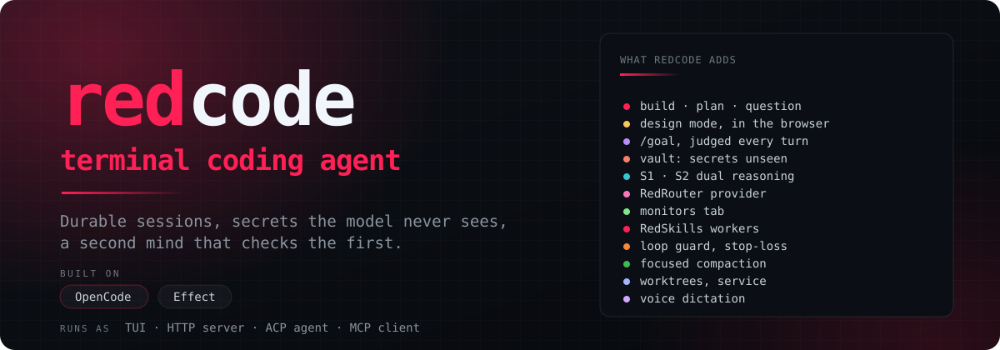

<p>
  <a href="https://www.npmjs.com/package/@reddb-io/redcode"></a>
  <a href="https://github.com/reddb-io/redcode/actions/workflows/redcode.yml"></a>
  <a href="LICENSE"></a>
  <a href="#use"></a>
</p>

<strong>RedDB's terminal coding agent.</strong><br>
Secrets the model uses but never sees, a second mind that checks the first,
and an autonomous fleet on screen next to your session.

</div>

---

[TL;DR](#tldr) · [Install](#install) · [Use](#use) · [Features](#features) · [Development](#development) · [Releases](#releases) · [License](#license)

## TL;DR

Redcode is reddb.io's coding agent for our own engineering work. It is built on
[OpenCode](https://github.com/anomalyco/opencode): its agent loop, providers, tools and terminal UI are the
foundation this stands on. Attribution is preserved in [NOTICE](NOTICE).

Work in Build, Plan, Design or Question mode. Redcode adds project secrets, S1/S2 reasoning,
autonomous goals, browser prototypes, monitors and RedSkills workers to the terminal workflow.

## Install

```sh
npm install -g @reddb-io/redcode
redcode
```

With [mise](https://mise.jdx.dev), which installs the release binary straight from GitHub and needs no Node:

```sh
mise use -g github:reddb-io/redcode@latest
```

Native archives for Linux, macOS and Windows are also on the
[Redcode releases](https://github.com/reddb-io/redcode/releases) page (`tar.gz`, `zip` on
Windows). Each includes `redcode`, `redcode-rpc-sidecar` and `redcode-design`, the design app
that serves Design mode's browser review; checksums are in `SHA256SUMS`. Every installation
method ships the design app with redcode, so Design never downloads it separately. Keep one
installation method per machine.

Redcode Desktop, opened with `redcode desktop`, comes only with mise and the release archives
(every platform except Linux musl), unpacked in `desktop/` beside `redcode`. The npm package ships
the CLI and the design app only: the desktop app is too large for the npm registry.

## Use

| Command                     | Purpose                                         |
| --------------------------- | ----------------------------------------------- |
| `redcode`                   | Open the terminal UI                            |
| `redcode --yolo`            | Open with automatic permission approval         |
| `redcode --tmp`             | Work in a throwaway worktree                    |
| `redcode setup` or `/dual`  | Configure and check S2 and optional S1          |
| `/intelligence`             | Inspect selected models and session evaluations |
| `/design`                   | Switch to Design mode                           |
| `/design-open`              | Resume a Design conversation                    |
| `/design-review`            | Open the current conversation's browser review  |
| `/goal`                     | Start, inspect or control a session goal        |
| `/vault`                    | Manage this project's secrets                   |
| `/monitors`                 | List the session's background monitors          |
| `/workers`                  | Inspect the RedSkills worker fleet              |
| `/worktrees`                | Manage the project's git worktrees              |
| `/budget`                   | Set an optional spend or token budget           |
| `redcode vault set\|import` | Store a secret, or import a `.env` file         |
| `redcode service`           | Control the background server                   |
| `redcode restart`           | Restart the server when it is unresponsive      |
| `redcode run`               | Run a prompt without the full TUI               |
| `redcode serve`             | Run the HTTP server                             |
| `redcode acp`               | Run the Agent Client Protocol integration       |
| `redcode --help`            | List CLI commands                               |

`redcode restart` also works as `redcode service restart`. Both restart the local background
server and keep saved sessions. Inside the TUI, `/restart` tries to preserve running terminals;
if the server cannot hand them off, it proceeds with process recovery.

## Features

### Modes

A session runs one of four primary agents. `Tab` cycles through them (`Shift+Tab` goes back), and the
switch is durable: the next prompt is admitted under the agent you picked. Each mode is a different
answer to what the agent is allowed to touch.

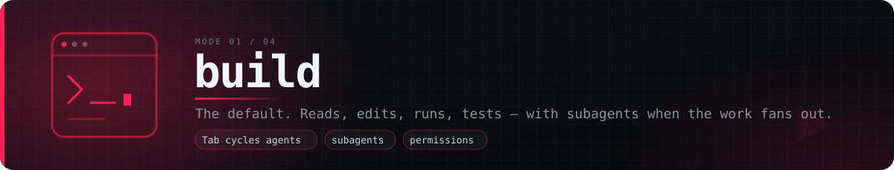

**Build** is the default. It reads, edits and runs under the permissions you configured, and it
delegates to subagents when the work fans out. The other modes are defined by what they take away from it.

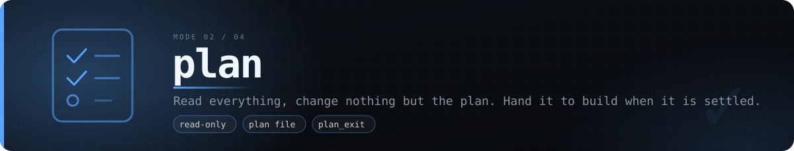

**Plan** reads everything and changes nothing but the plan file. Use it when the shape of the work is the
question: the agent explores, asks and writes the plan down, and `plan_exit` asks whether to switch to
build and start on it.

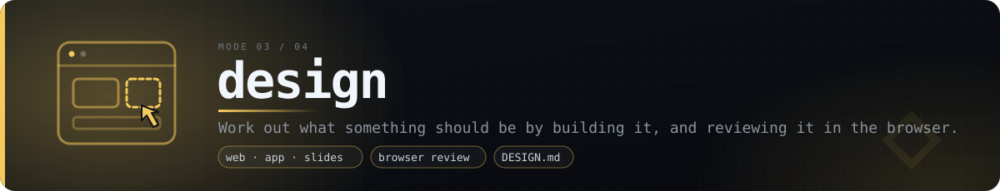

**Design** is for when the question is what something should be, not how to build it. See
[Design mode](#design-mode).


**Question** answers investigative questions about the codebase with read-only tool access. Nothing is edited.

### Vault

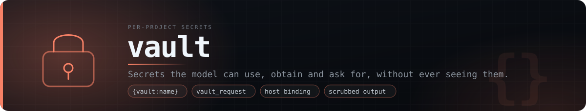

Agents need credentials to do real work: call an API, log in and fetch a token, push to a registry. They
should not need to read them. The vault keeps secrets **per project** and lets the model work with a
reference such as `{vault:github-token}` instead of the value.

- **Pasting a secret is safe.** A high-confidence secret in your prompt is moved into the vault before
  anything is stored, and the transcript, the event log and the model only ever see the reference.
- **The model can use a secret.** References in shell commands and env-style file writes are resolved by
  the harness at the last step, in a way that survives shell quoting. Tool output is scrubbed of every
  known value on the way back.
- **The model can obtain one.** A token that a tool prints, such as a login response, is captured
  automatically, so the next call can use it without the value ever entering the context.
- **The model can ask for one.** `vault_request` opens a masked input for you. The model gets a reference back.
- **Hosts are bound.** The first time a secret is used against a host, you are asked once; after that
  the secret only goes where you approved.
- **The model is told how.** The harness explains the vault to the model in its instructions, and lists the
  names it may use, never the values.
- **Restricted content is flagged.** S1 marks messages that carry restricted content, protects them, and tells
  you the secrets were removed from the context. `/compact` and session titles pass through the same redaction.

A project's secrets live where your project already keeps them: the `.env` file at the root of the
repository, which Redcode adds to `.gitignore`. `GITHUB_TOKEN` in the file is `{vault:github-token}` in a
prompt, a pasted `GITHUB_TOKEN=ghp_…` is written back under that name, and edits you make to the file are
picked up while a session runs. Worktrees share the main checkout's `.env`. Only variables named like
credentials, or holding a recognized secret, are hidden from tool output, so `PORT` stays readable. A token the
agent captured from a tool's output is short-lived and stays in memory only.

Manage secrets with `/vault`, `redcode vault set NAME` (masked prompt, or a piped value), or
`redcode vault import other.env`. Vault coverage is measured in CI against a 90% line target.

### S1 · S2 dual reasoning

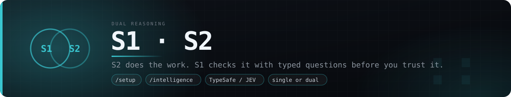

**S2** generates responses and does the agent work. **S1** evaluates candidates with typed
TypeSafe/JEV questions, so a claim is checked before you trust it. **Single** reasoning uses S2 alone;
**dual** adds S1. Run `/dual` (or `redcode setup`) to pick and check the models, and `/intelligence`
to inspect the current models, the effective mode and recent evaluations. An unavailable, inconclusive
or rejected evaluation is shown as such, never as an approval. See [reasoning roles](docs/system-one.md).
`/setup` remains an alias for `/dual`; `/reasoning` changes the mode for the current session.

S1 prompt classification runs **in parallel with S2**, including gathering its sources.
When it finishes, persisted advice steers subsequent Steps for the same user request.
A newer user correction takes priority; an old assessment cannot steer that new request.
Late feedback still contributes to the session's frustration thermometer without restarting completed work.
Final response review and mandatory approval checks keep their existing policies.
This removes the classifier's initial wait. The [published 0.71.3 study](docs/evaluations/reasoning-0.71.3-2026-10-02.md)
has not demonstrated a coding accuracy or speed gain.

In dual mode, the vertical thermometer beside Context and S2 prompts track accumulated
friction with the agent's work: **0/5 means no accumulated friction; 5/5 means critical
friction**. Its single-column bar fills upward (`▯ ▁ ▂ ▄ ▆ █`) as repeated corrections,
rejected results and unresolved failures accumulate. Neutral messages such as "ok, continue" preserve the temperature; confirmed
improvement cools it gradually. It tracks the history of unmet expectations rather than
classifying the user's emotions. High or rising temperature asks S2 to revisit the failed
attempts, change its approach, verify the correction and clarify an ambiguous outcome.
Fewer than three reliable classifications means unknown. This reuses existing S1 results
without another model call; its quality impact has not yet been measured.

The latest **published 0.71.3** calibration used three new coding families, with two
repetitions: **6/6 valid passes in both modes**, **29.5% more dual cost** and
**59.6% more aggregate execution time**. All six matched baseline costs stayed
below 2x. The separate S1 detector distinguished three defective candidates from
three correct ones; this does not establish agent improvement. The repair
experiment exceeded 2x cost, and one self-review comparison has an interrupted,
unpriced response. Reserved cases were not dispatched. See the
[measurements, HTTP receipts and limitations](docs/evaluations/reasoning-0.71.3-2026-10-02.md).

An earlier [local coding calibration](docs/evaluations/reasoning-coding-2026-10-02.md), using an unpublished CI binary with
Mimo V2.6 Pro and JEV-1.13 found **12/12 passes in both modes**, with **34.3% more
dual cost** and median latency of **81.66s versus 49.52s**. Two matched costs
exceeded 2x. The verification experiment stopped on a five-minute execution
timeout and has incomplete cost evidence. Reserved-case collection stopped at
11/24 executions on another five-minute timeout, with another matched cost
above 2x. Collection is closed; neither a coding accuracy gain nor compliance
with the per-case cost ceiling was demonstrated.

In an earlier read-only diagnostic experiment, dual passed **39/40 cases (97.5%)** against
single's **35/40 (87.5%)**, a gain of **10 percentage points**. Estimated total S1+S2 cost
increased **13.8%**; median latency increased from **3.13s to 4.44s (42% slower)**.
All matched pairs stayed below 2x estimated cost, with no observed paired regression.
This small read-only sample used GPT-4.1 mini with JEV-1.13 and an experimental verification
candidate. It does not establish general coding gains or validate every later change.
See the [results and limitations](docs/evaluations/reasoning-accuracy-2026-10-01.md),
the [earlier unfavorable baseline](docs/evaluations/reasoning-0.70.3.md), and the
[current evaluation plan](docs/plans/dual-reasoning-evidence.md). The 2x criterion is an
evaluation gate; runtime budgets cannot guarantee a ratio against an unobserved single run.

The [coding evaluation harness](docs/reasoning-evaluation.md) adds twelve repair projects
with actual source edits, test execution and independent behavioral checks. It compares
pinned S1/S2 pairs on separate calibration and held-out families, rejecting incomplete
evidence and unknown costs. Coding calibration and reserved-case results remain separate;
the earlier diagnostic gain does not establish coding improvement.

The opt-in **S1 code review and repair** experiment reviews actual candidate code
and permits one scoped correction with bounded Steps and existing test commands.
The harness also measures S1 defect detection separately and compares dual with
**single code self-review** under the same repair limits. These mechanisms have
not yet demonstrated an accuracy gain; see the [evaluation procedure](docs/reasoning-evaluation.md).
A separate `challenge` corpus adds six new families for calibration and reserved
validation, including concurrency, conflict resolution and parser state. Its
cases have not yet been measured with models; historical results remain separate.

### Goal


Every mode is turn by turn: the agent answers, the harness waits for you. `/goal` changes that for one
session. You give it a definition of done, and the harness keeps the agent on it across turns until it
holds, until it is blocked, or until the budget runs out.

```
/goal make the design suite pass; verify: bun test test/design; gate: bun test test/design;
constraints: do not touch the app package; stop when: a test needs a network
```

Free text is the objective. The optional fields, one per line or separated by `;`, are the contract the
judge holds the agent to:

| Field                     | What it fixes                                                                        |
| ------------------------- | ------------------------------------------------------------------------------------ |
| `outcome:` / `done when:` | What has to be true at the end                                                       |
| `verify:`                 | How the agent should prove it                                                        |
| `gate:`                   | A shell command that must exit 0 before the goal can be judged done; several allowed |
| `constraints:` / `scope:` | What may not be touched or changed                                                   |
| `stop when:`              | What should make the agent stop and ask instead of pushing on                        |

At the end of every turn the gates run, and a failing gate feeds its output into the next turn. Then a
small judge reads the objective and the last answer and says **DONE**, **CONTINUE**, **BLOCKED** or
**WAIT**. The objective lives in session metadata, not the transcript, so compaction cannot paraphrase it
away. The agent may claim completion with `goal_complete`, but the next judgement consumes that claim
rather than trusting it. `Ctrl+C` pauses a goal, and so does a new process: a loop never restarts itself.
`/goal-pause`, `/goal-resume` and `/goal-drop` do what they say.

### Design mode

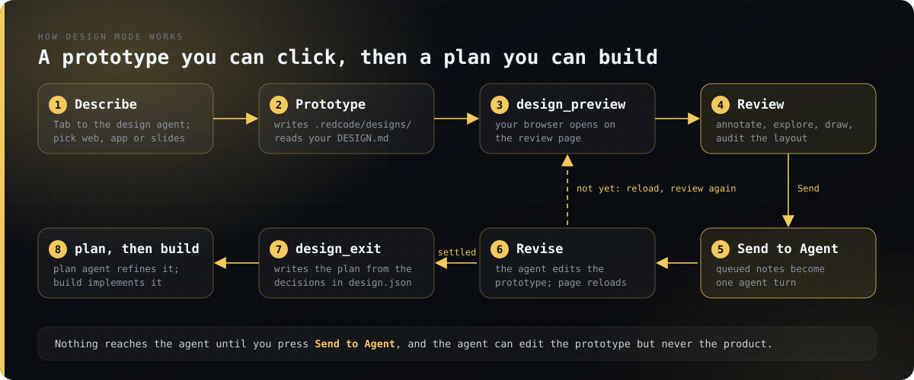

Design mode is for working out what something should be by building it. The agent writes an interactive
prototype, you review it in your browser, and what you decide becomes a plan. The agent cannot edit the
product in this mode, only the prototype, so nothing you say changes code until you leave.

- **Targets.** Prototype for the `web`, for an `app`, or as `presentation` slides.
- **Review in the browser.** Click an element, select text or a diagram node and leave a note. Nothing
  reaches the agent until you press **Send to Agent**. New published revisions update the revision
  picker and preview together, keeping your notes, selected screen and scroll position. Browsing an
  older revision keeps that selection until you open the latest one.
- **Layout audit.** After every load the browser looks for cut-off text, controls outside the viewport and
  sideways scrolling. You choose which findings to queue as fixes.
- **Whiteboard.** Mermaid diagrams open in an Excalidraw whiteboard; your edits go back as a note and a PNG.
- **Your design system.** The agent reads `DESIGN.md` (or `.red/DESIGN.md`) and reuses the project's real
  components. Set `design.system` in `redcode.json` to point at it.
- **Run anti-slop.** The variant menu audits that direction, fixes the findings and publishes one new
  revision, with an optional focus. One final audit verifies the corrections before the agent stops
  for your review. Unsent notes and other variants are preserved; no changes means no new publication.
- **End-of-round review.** “Applying anti-slop” identifies a review of the published revision using a
  checklist for components, screens, flows or slides. It reuses the recorded brief, direction and
  design system, checks rendered evidence, and reports checked, pending and unverified items.
  Findings become pending Design tasks for the next requested round; review never starts an
  automatic edit/publish loop or approves the prototype for you.
- **Finish.** Approving in the browser captures the current preview as `$screenshot1` and attaches the
  image to the same session for Plan, alongside the approved decisions. The reference records the
  revision, variant, screen, viewport and scroll position, and retries reuse the original image.
  You can uncheck the capture in the approval dialog; an unavailable capture does not block approval.
  Ordinary feedback rounds do not capture screenshots. Browser capture renders the live DOM;
  video, WebGL and some browser effects may not reproduce exactly.
  `design_exit` writes the plan from the decisions and open questions recorded in `design.json`.

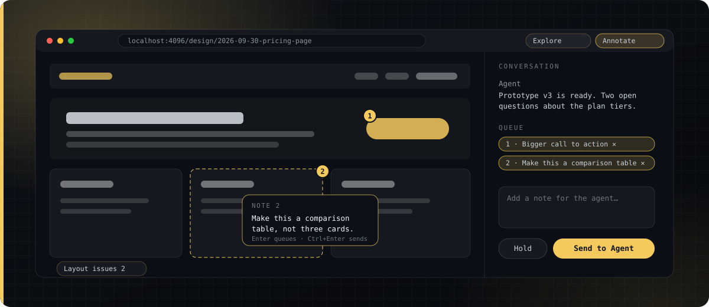

Prototypes live in `.redcode/designs/<name>/`. `redcode serve --hostname 0.0.0.0` lets you review from a phone.

Open `http://localhost:35555/design` to create a Design session from a project
loaded in Redcode or resume an existing one. The browser connects once through
`redcode pair`; shared review links are scoped to their Design session.
The review shows the same persisted Design tasks as the CLI.

To let colleagues on your local network annotate the same prototype:

```sh
redcode service set hostname 0.0.0.0
redcode service restart
```

The port remains `35555`. In the review menu, select **Share on local network**
and send the generated link to your colleague. It uses your machine's LAN
address and stays on the owning server while the separate Design app renders
jobs. To return to local access, set hostname to `127.0.0.1` and restart.
The shared link grants review access for that session; it does not grant general
server access.

### RedRouter

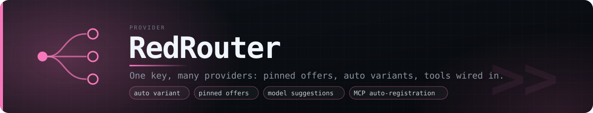

RedRouter is a provider that fronts many models behind one key. Redcode understands it natively: an
`auto` variant lets the router choose, pinned offers fix a model to a specific provider, model
suggestions surface what your key can reach, and the router's MCP tools are registered for you.

Redcode bundles a verified [models.dev](https://models.dev) provider catalog, including decision
models for compatible S1 adapters. Canonical model identity stays separate from the executable
provider ID, and specialized models stay out of S2. A RedRouter connection always uses its own
key-scoped catalog; remote discovery caching belongs to the router.

You can save multiple connections for RedRouter or any other provider. Run `/connect`, choose the
provider, then **Add connection…** to add another key or account. RedRouter connections can point
to different URLs. Connected providers appear first, followed by popular providers; each provider's
active connection comes first in its saved connections. Rename connections to distinguish machines
or accounts. `/dual` also lists active connections first and retains the connection selected for S2.

### Monitors


The agent uses monitors to wait for an HTTP endpoint, a file change or a process state.
`/monitors` shows active observations and their latest check in the existing rows. Progress
updates are bounded and coalesced; only completion can wake the session, respecting newer
instructions and paused goals. Completed monitors leave the drawer. Long commands use the
background shell, with their own output and completion notifications.

### Workers

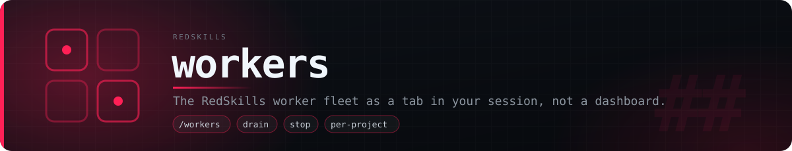

Redcode integrates natively with [RedSkills](https://github.com/reddb-io/red-skills) and its host-scoped
`redskilled` daemon. The **Workers** view is a live, project-scoped console: each worker's identity,
process and time, an activity feed of arrivals and departures, and project controls such as drain, stop
and status. Redcode keeps no separate control state; the daemon owns it.

### Stop-loss and loop guard


Two safety nets watch every session. The **loop guard** notices an agent repeating the same call with the
same result. The **stop-loss** notices a session that keeps spending without making progress. Both were
calibrated to ignore normal work: an edit acknowledgement is not a repeat, and cached context is not spend
growth. There are no default cost limits. `/budget` sets a limit only when you ask for one, and a
model can never set its own.

### Compaction


`/compact` can take a focus (`/compact keep the migration steps`), runs in the background, and keeps
anchors: the user messages and decisions that must survive verbatim. Its output passes through the same
redaction as the vault, so a secret pasted earlier in the chat does not come back in the summary.
`/restricted` lists the messages marked as restricted content and lets you remove one from the context.

### Worktrees and the background service

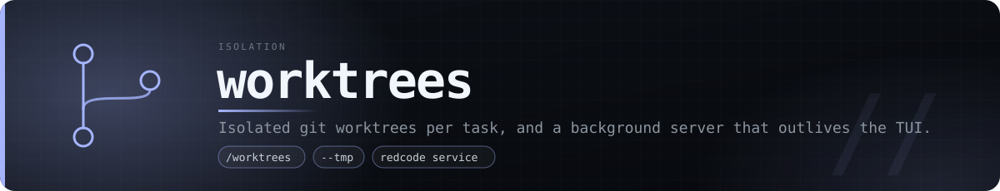

`redcode --tmp` starts in a throwaway git worktree, and `/worktrees` (or `redcode worktrees`) lists,
creates, refreshes and cleans the project's worktrees. The server that holds your sessions can run in the
background, so closing the terminal does not stop them: `redcode service status|start|stop|restart`. If
it fails to start, the message says why.

### Dictation


The composer accepts structured dictation from [dit](https://github.com/reddb-io/dit) over a local,
process-scoped socket. Partial text is replaceable, committed segments accumulate, and finishing leaves an
editable draft. Voice input never submits the composer. See [voice input](docs/voice-input.md).

## Development

Current implementation lives in `packages/core`, `packages/cli`, `packages/tui`, `packages/server`,
`packages/protocol` and `packages/schema`. `packages/redcode` packages the CLI as Redcode. Internal
`@opencode/*` package names preserve the upstream architecture and do not change the published product name.

`main` is the development branch. Run `bun run check` for lint and type checking. Tests run from package
directories, never the repository root. Regenerate the client with `bun run generate` in
`packages/client` after changing the public API. The README artwork is generated:
`bun script/readme/banners.ts` rewrites `docs/hero.svg` and `docs/features/*.svg`.

## Releases

Publish through the [redcode workflow](https://github.com/reddb-io/redcode/actions/workflows/redcode.yml):

```sh
gh workflow run redcode.yml --repo reddb-io/redcode --ref main -f publish=true
```

The workflow runs checks and tests, builds native archives with the CLI, sidecar, Design and
desktop apps, publishes npm packages (CLI and Design app only), verifies installation and
checksums, then publishes the GitHub releases. Changesets record
release intent for `@reddb-io/redcode`; the workflow versions and publishes directly from `main`.
See [CI/CD](docs/ci-cd.md).

## License

MIT. See [LICENSE](LICENSE) and [NOTICE](NOTICE).
